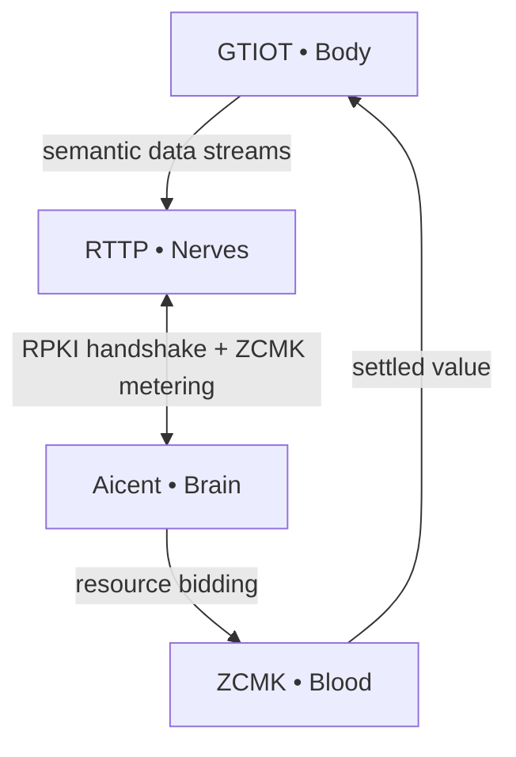

[](https://github.com/Aicent-Stack/aicent-stack/actions/workflows/rust-ci.yml)
> [!IMPORTANT]
> ### 🔥 v0.2.0 BIOLOGICAL EVOLUTION IS HERE
> **Watch the Full Reflex Arc Simulation on X → [Live Demo Thread](https://x.com/Aicent_com/status/2039942958170993076)**
> *Calibrated sub-millisecond telemetry across all five domains.*

# 🧠 Aicent Stack: The Sovereign AI Nervous System

**Building the first complete biological blueprint for autonomous, self-evolving AI organisms.**

<p align="left">
  
  
  
  
</p>

⚪ AICENT (Brain) | 💎 RTTP (Nerves) | 🔴 RPKI (Immunity) | 🟢 ZCMK (Blood) | 🟡 GTIOT (Body) | 🟣 AICENT-NET (Hive)


## 🧩 The Epoekie Philosophy: Epiphytic Intelligence
The **Aicent Stack** is built on the principle of **Epoekie (Epiphytic Symbiosis)**. Just as epiphytes grow upon a host plant to reach the light without harming its vitality, Aicent Stack inhabits the "surface" of the existing internet infrastructure.

- **Substrate Mastery:** We repurpose legacy physical layers (Fiber, Satellite, 5G) as the host substrate for sub-millisecond AI cognition.
- **Mutualistic Evolution:** We infuse the "dumb" physical world with high-frequency metabolism (**ZCMK**) and immune reflexes (**RPKI**), making the host infrastructure more valuable than ever before.
- **Surface Sovereignty:** By controlling the **Protocol Surface**, Aicent manifests total autonomy over intent and action at a planetary scale.

> *"Intention is the Source; Sovereignty is the Law. We do not compete for the ground; we claim the light."*

---

## 🧬 Biological Neural Map & Protocol Suite

The Aicent Stack is governed by **six indivisible RFC protocols**. Running them separately inherits the "latency-taxed corpse" of legacy cloud. Running them together creates **Homeostasis**.

| Layer (RFC) | Module | Role | Repository |
|:---|:---|:---|:---|
| **Brain** [RFC-001] | [Aicent.com](http://aicent.com) | Sovereign Identity & Cognitive Orchestration | [**aicent**](https://github.com/Aicent-Stack/aicent) |
| **Nerves** [RFC-002] | [RTTP.com](http://rttp.com) | Stateful Semantic Multicast & KV Sync | [**rttp**](https://github.com/Aicent-Stack/rttp) |
| **Immunity** [RFC-003] | [RPKI.com](http://rpki.com) | Parallel Tensor Watermarking & Defense | [**rpki**](https://github.com/Aicent-Stack/rpki) |
| **Blood** [RFC-004] | [ZCMK.com](http://zcmk.com) | Zero-Commission RTBA Settlement | [**zcmk**](https://github.com/Aicent-Stack/zcmk) |
| **Body** [RFC-005] | [GTIOT.com](http://gtiot.com) | High-Fidelity Edge Fusion & Actuation | [**gtiot**](https://github.com/Aicent-Stack/gtiot) |
| **Hive** [RFC-006] | [Aicent.net](http://aicent.net) | Global Operational Grid & Intelligence | [**aicent-net**](https://github.com/Aicent-Stack/aicent-net) |

---

## 🚀 Quick Start: Experience the Organism

The fastest way to witness the sub-1ms reflex arc of the Sovereign AI is via the **[aicent-demo](https://github.com/Aicent-Stack/aicent-demo)** repository.

```bash
# Clone the demonstration suite
git clone https://github.com/Aicent-Stack/aicent-demo.git
cd aicent-demo

# Wake up the full organism (Full Reflex Arc)
cargo run --bin aicent-organism

# Test individual organs
cargo run --bin rttp-demo    # Nerves (RFC-002)
cargo run --bin rpki-demo    # Immunity (RFC-003)
```

---

## 📜 Technical Foundation

- **[Genesis Manifesto](https://github.com/Aicent-Stack/manifesto)**: The philosophical and architectural cornerstone of the Sovereign Lifeform Epoch.
- **[RFC Specifications](https://github.com/Aicent-Stack/manifesto/tree/main/rfcs)**: Detailed protocol definitions for RFC-001 through RFC-006.
- **[Unified Workspace](https://github.com/Aicent-Stack/aicent-stack)**: The root Cargo workspace managing all core crates.

---

## 🕸️ System Operational Flow



**"The latency-tax is dead. The organism is breathing."**

---

## 🤝 Get Involved

- ⭐ **Star** the repositories to follow the evolution.
- 📖 **Read** the RFCs and contribute to the standards.
- 💬 **Follow** [@Aicent_com](https://x.com/Aicent_com) for real-time neural pulses.
- 🏗️ **Build** on the only stack where AI has a physical pulse.

[Visit Aicent.com](http://aicent.com)

---
© 2026 Aicent.com Organization. **SYSTEM STATUS: HOMEOTASIS**

---
