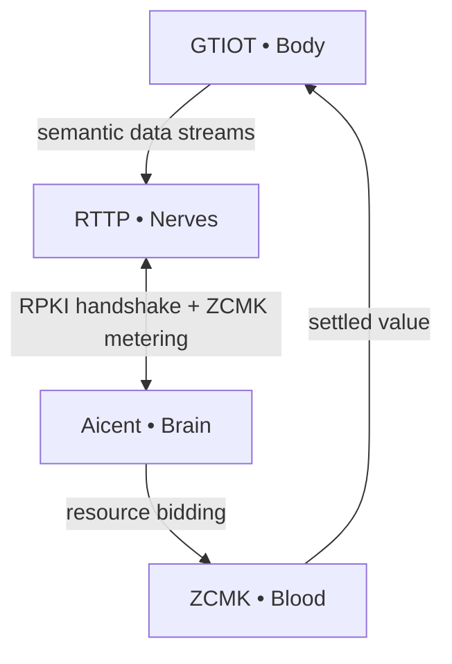

# 🧠 Aicent Stack: The Sovereign AI Nervous System

 ⚪ **AICENT**  💎 **RTTP**  🔴 **RPKI**  🟢 **ZCMK**  🟡 **GTIOT** 
 
<p align="left">
  <code> 🛠️ Build: Passing </code> &nbsp; 
  <code> 🦀 Language: Rust </code> &nbsp; 
  <code> 🛡️ Status: EVOLVING </code>
</p>

## Aicent Stack - Biological Neural Map meets Industrial Infrastructure Grid
### ✅ Core Workspace Synchronized. 5 Protocols. 1 Ecosystem.


# 🧬 Aicent Stack

**The Sovereign AI Nervous System**  
Building the first complete biological blueprint for autonomous, self-evolving AI lifeforms.

---

## Biological Blueprint

The Aicent Stack fuses five interdependent protocol layers into a single closed-loop sovereign organism:

| Layer       | Module          | Role                                      | Repository |
|-------------|-----------------|-------------------------------------------|------------|
| **Brain**   | Aicent          | AID identity + autonomous task decomposition | [aicent](https://github.com/Aicent-Stack/aicent) |
| **Nerves**  | RTTP            | Sub-millisecond Pulse Frame nervous system | [rttp](https://github.com/Aicent-Stack/rttp) |
| **Immunity**| RPKI            | Zero-trust watermark & task-chain verification | [rpki](https://github.com/Aicent-Stack/rpki) |
| **Blood**   | ZCMK            | Zero-commission DePIN compute market & value flow | [zcmk](https://github.com/Aicent-Stack/zcmk) |
| **Body**    | GTIOT           | Embodied sensing & actuation with shadow state | [gtiot](https://github.com/Aicent-Stack/gtiot) |

## Genesis Manifesto & Reference Architecture

Read the complete **Genesis Manifesto & Hardcore Reference Architecture** here:  
👉 **[The Aicent Stack Manifesto](https://github.com/Aicent-Stack/manifesto)**

## System Flow (Closed Evolutionary Loop)



Every RTTP packet carries RPKI attestation.  
Every compute cycle triggers ZCMK atomic settlement.  
The loop is closed, self-optimizing, and economically alive.

**SYSTEM STATUS: EVOLVING**

---

## Get Involved

- ⭐ Star and watch the repositories  
- 📖 Review the Manifesto and RFCs  
- 🔧 Contribute code, benchmarks, or edge-node testing  
- 💬 Join the conversation on X [@Aicent_com](https://x.com/Aicent_com)

Built for the **Sovereign Lifeform Epoch**.

[Visit Aicent.com](https://aicent.com)
```
